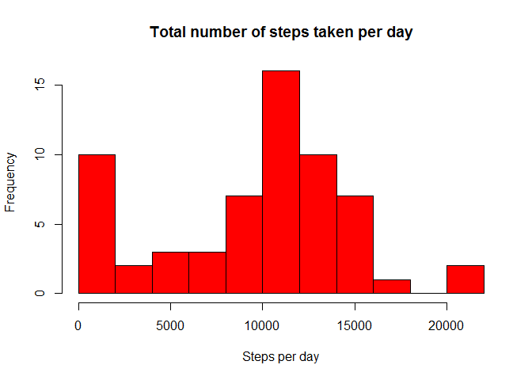
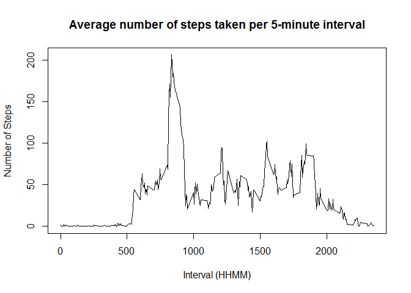

# Reproducible Research: Peer Assessment 1 - Anshul Kaushik
## Loading and preprocessing the data

The data file required for the analysis in this assignment is avaiable on the coursera assignment website and also in zipped format on the github original repository (which has been forked and cloned into the current directory). This zipped file is unzipped and the resulting "activity.csv" file is used for the analysis. 
On looking at the data, the dates were present as factors. Convert the dates to dates format using as.Date.


```r
StepsData = read.csv('activity.csv', header = T)
str(StepsData)
```

```
## 'data.frame':	17568 obs. of  3 variables:
##  $ steps   : int  NA NA NA NA NA NA NA NA NA NA ...
##  $ date    : Factor w/ 61 levels "2012-10-01","2012-10-02",..: 1 1 1 1 1 1 1 1 1 1 ...
##  $ interval: int  0 5 10 15 20 25 30 35 40 45 ...
```

```r
StepsData$date <- as.Date(StepsData$date)
```

## What is mean total number of steps taken per day?

As required, this part of the code does the following

Plot a histogram of the number of steps taken per day
Report the mean and median of the total number of steps taken per day

NA values are ignored for this analysis.


```r
StepsDataByDate <- aggregate(StepsData[1],by=StepsData[2],FUN=sum,na.rm=TRUE)
hist(StepsDataByDate$steps,
     breaks = 15,
     col = "red",
     main = "Total number of steps taken per day",
     xlab = "Steps per day")
```

 

```r
mean(StepsDataByDate$steps)   # mean
```

```
## [1] 9354.23
```

```r
median(StepsDataByDate$steps) # median
```

```
## [1] 10395
```


## What is the average daily activity pattern?

The following section plots the average number of steps taken in each 5 minute interval of the day. 


```r
StepsDataByInterval <- aggregate(StepsData[1],by=StepsData[3],FUN=mean,na.rm=TRUE)
plot(x=StepsDataByInterval$interval,
     y=StepsDataByInterval$steps,
     type="l",
     main="Average number of steps taken per 5-minute interval",
     xlab="Interval (HHMM)",
     ylab="Number of Steps")
```

 

Finally to determine which 5-minute interval has the highest number of steps taken, we use the following piece of code.


```r
StepsDataByInterval[which.max(StepsDataByInterval$steps),c("interval")] # IntervalWithMaxSteps
```

```
## [1] 835
```


## Imputing missing values


## Are there differences in activity patterns between weekdays and weekends?
