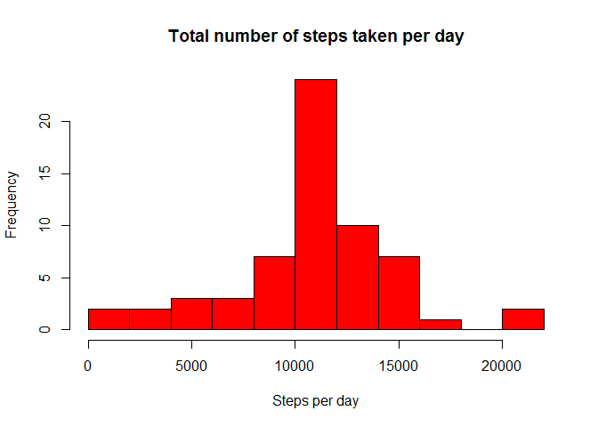
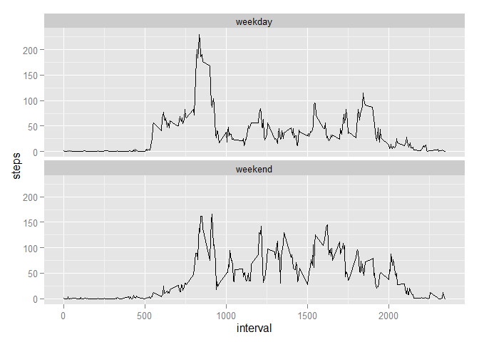

# Reproducible Research: Peer Assessment 1 - Anshul Kaushik
## Loading and preprocessing the data

The data file required for the analysis in this assignment is avaiable on the coursera assignment website and also in zipped format on the github original repository (which has been forked and cloned into the current directory). This zipped file is unzipped and the resulting "activity.csv" file is used for the analysis. 
On looking at the data, the dates were present as factors. Convert the dates to dates format using as.Date.


```r
StepsData = read.csv('activity.csv', header = T)
str(StepsData)
```

```
## 'data.frame':	17568 obs. of  3 variables:
##  $ steps   : int  NA NA NA NA NA NA NA NA NA NA ...
##  $ date    : Factor w/ 61 levels "2012-10-01","2012-10-02",..: 1 1 1 1 1 1 1 1 1 1 ...
##  $ interval: int  0 5 10 15 20 25 30 35 40 45 ...
```

```r
StepsData$date <- as.Date(StepsData$date)
str(StepsData)
```

```
## 'data.frame':	17568 obs. of  3 variables:
##  $ steps   : int  NA NA NA NA NA NA NA NA NA NA ...
##  $ date    : Date, format: "2012-10-01" "2012-10-01" ...
##  $ interval: int  0 5 10 15 20 25 30 35 40 45 ...
```

## What is mean total number of steps taken per day?

As required, this part of the code does the following

Plot a histogram of the number of steps taken per day
Report the mean and median of the total number of steps taken per day

NA values are ignored for this analysis.


```r
StepsDataByDate <- aggregate(StepsData[1],by=StepsData[2],FUN=sum,na.rm=TRUE)
hist(StepsDataByDate$steps,
     breaks = 15,
     col = "red",
     main = "Total number of steps taken per day",
     xlab = "Steps per day")
```

 

```r
mean(StepsDataByDate$steps)   # mean
```

```
## [1] 9354.23
```

```r
median(StepsDataByDate$steps) # median
```

```
## [1] 10395
```


## What is the average daily activity pattern?

The following section plots the average number of steps taken in each 5 minute interval of the day. 


```r
StepsDataByInterval <- aggregate(StepsData[1],by=StepsData[3],FUN=mean,na.rm=TRUE)
plot(x=StepsDataByInterval$interval,
     y=StepsDataByInterval$steps,
     type="l",
     main="Average number of steps taken per 5-minute interval",
     xlab="Interval (HHMM)",
     ylab="Number of Steps")
```

 

Finally to determine **which 5-minute interval has the highest number of steps taken**, we use the following piece of code.


```r
StepsDataByInterval[which.max(StepsDataByInterval$steps),c("interval")] # IntervalWithMaxSteps
```

```
## [1] 835
```


## Imputing missing values

1. Reporting the total number of missing values


```r
sum(is.na(StepsData$steps)) # missing values
```

```
## [1] 2304
```

2&3. Impute the missing data and create a new dataset. 

**Imputation Strategy** - The missing values in an interval are replaced by the mean of all the non-NA values in the given interval. 

```r
library(plyr)
imputeWithMean <- function(x) replace(x, is.na(x), mean(x, na.rm = TRUE))
StepsDataImputed <- ddply(StepsData, ~interval, transform, steps = imputeWithMean(steps))
```

4. Plot histogram, compute the mean and median to see what are the differences from original dataset.

```r
StepsDataImputedByDate <- aggregate(StepsDataImputed[1],by=StepsDataImputed[2],FUN=sum,na.rm=TRUE)
hist(StepsDataImputedByDate$steps,
     breaks = 15,
     col = "red",
     main = "Total number of steps taken per day",
     xlab = "Steps per day")
```

 

```r
mean(StepsDataImputedByDate$steps)   # meanImputed
```

```
## [1] 10766.19
```

```r
median(StepsDataImputedByDate$steps) # medianImputed
```

```
## [1] 10766.19
```

Interestingly, as seen in the histogram, because of the imputation, the number of days with 0-2500 steps has reduced drastically and the peak near the median has become higher, indicating that the distribution is more normal now than before. Also, becuase of this, the mean and median are now very close to each other. The mean has had a bigger change, and the median has only moved slightly.

## Are there differences in activity patterns between weekdays and weekends?

The following code chunk is used to create a variable with designation for the day as weekday or weekend

```r
StepsDataImputed$Day <- weekdays(StepsDataImputed$date)
StepsDataImputed$DayDesignation <- "weekday"
StepsDataImputed$DayDesignation [StepsDataImputed$Day %in% c("Saturday","Sunday")] <- "weekend"
```

To compare weekdays with weekends, the following code produces the plot.

```r
StepsDataImputedByInterval <- aggregate(StepsDataImputed[1],
                                   by=StepsDataImputed[c(3,5)],
                                   FUN=mean,
                                   na.rm=TRUE)
library(ggplot2)
plot <- ggplot(data = StepsDataImputedByInterval, aes(x=interval,y=steps))
plot + geom_line() + facet_wrap(~DayDesignation,nrow=2)
```

 

Many interesting observations can be made using this plot.
 - There are much lesser steps between 5 AM and 8 AM on weekends compared to weekdays, possibly indicating late start to the day
 - In contrast, there are many more steps post 8 PM on weekends compared to weekdays, possibly indicating later end to the day.
 - On weekends, the steps between 10AM and 6 PM are more compared to weekdays. This may be indicative of outdoor activities over the weekend, compared to desk jobs/ household work over the weekday.
